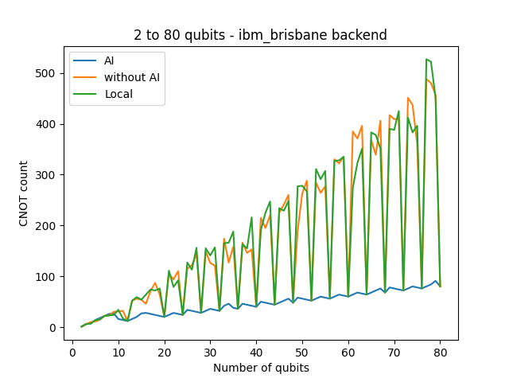

# IBM Quantum Transpiler test

During the IBM quantum challenge 2024 edition, we used some state of the art technology for circuit transpilation based on AI. 

Especially, one of the challenges showed us some graphs comparing the default transpilation with this new one with AI capabilities. By the the end of it, they challenged us to explore it more, testing with different paramters and backends to see how it could go. 

So, here I am, In this repo you can find some code that I did and some results and that I'd reached.

All the data was exported to `.json` files to be replicable, in case you want to test by your own.

The backeds that I used were `ibm_sherbrooke` and `ibm_brisbane`, however they share the same IBM QPU, so the results may be biased by that. Nevertheless, it's still nice to see how this new transpiler is helpful for big circuits.

## how to use

```bash
# create a conda environment
conda env create -f environment.yml
conda activate transpiler-test

# set your ibm token
echo IBM_TOKEN=YOUR_TOKEN >> .env

# start the jupyter notebook
jupyter lab
```

## Results


